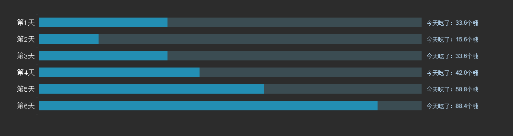
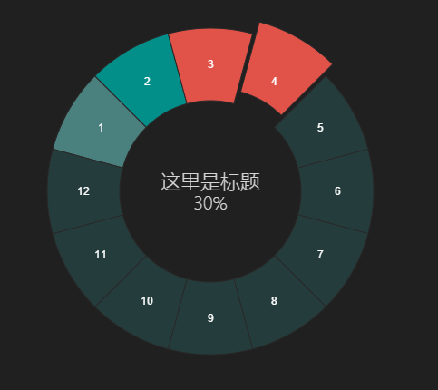
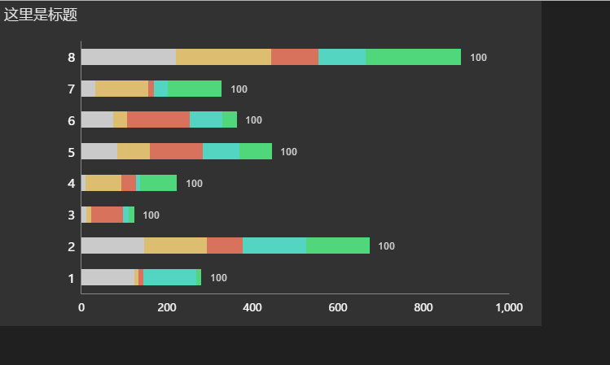

# echarts2-demo 
这是Echarts2的小例子，是百度研发的，很好用，API强大，（还有一版Echart3,目前还没写例子）会持续更新，喜欢请Star 

这是require进来的，按需加载就好，点击事件就加载config.js
 
官网 API：http://echarts.baidu.com/echarts2/doc/doc.html 
CSDN ：http://blog.csdn.net/YangBingX 

.

----
效果图：

1、条形图--等长

2、圆环扇形

3、分组柱状图

4、堆积条形图

